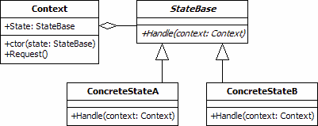
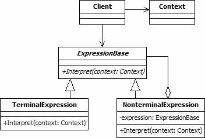

# Behavioral Design Patterns

## State Pattern

The state pattern is a design pattern that allows an object to completely change its behaviour depending upon its current internal state. By substituting classes within a defined context, the state object appears to change its type at run-time.

The state pattern is useful when creating object-oriented state machines, where the functionality of an object changes fundamentally according to its state. By using multiple concrete classes, each inheriting from the same base class, large differences in functionality are possible without resorting to numerous "if" or "switch" statements.

The UML class diagram above describes an implementation of the state design pattern. The items in the diagram are described below:

* Context. The Context class is used by clients of the state design pattern. Clients do not access the state objects directly. The Context class holds a concrete state object that provides the behaviour according to its current state.

* StateBase. This abstract class is the base class for all concrete state classes. StateBase defines the interface that will be used by the Context object to access the changeable functionality. No state, in terms of fields or properties, is defined in the StateBase class or its subclasses.

* ConcreteState A/B. The concrete state classes provide the real functionality that will be used by the Context object. Each state class provides behaviour that is applicable to a single state of the Context object. They may also include instructions that cause the Context to change its state.

## Interpreter Pattern

The interpreter pattern is a design pattern that is useful when developing domain-specific languages or notations. The pattern allows the grammar for such a notation to be represented in an object-oriented fashion that can easily be extended.

The interpreter design pattern is useful for simple languages where performance is not critical. As the grammar becomes more complex, the number of different expression types, each represented by its own class, can become unwieldy and lead to unmanageable class hierarchies. This can also slow the processing of the expressions. For these reasons, the pattern is considered to be inefficient and is rarely used. However, it should not be discounted for some situations.

The UML class diagram above shows an implementation of the interpreter design pattern. The items in the diagram are described below:

* Client. The client class represents the consumer of the interpreter design pattern. Client objects build the tree of expressions that represent the commands to be executed, often with the help of a parser class. The Interpret method of the top item in the tree is then called, passing any context object, to execute all of the commands in the tree.

* Context. The context class is used to store any information that needs to be available to all of the expression objects. If no global context is required this class is unnecessary.

* ExpressionBase. This abstract class is the base class for all expressions. It defines the Interpret method, which must be implemented for each subclass.

* TerminalExpression. Terminal expressions are those that can be interpreted in a single object. These are created as concrete subclasses of the ExpressionBase class.

* NonterminalExpression. Non-terminal expressions are represented using a concrete subclass of ExpressionBase. These expressions are aggregates containing one or more further expressions, each of which may be terminal or non-terminal. When a non-terminal expression class's Interpret method is called, the process of interpretation includes calls to the Interpret method of the expressions it holds.

## Specification pattern

The specification pattern is a particular software design pattern, whereby business rules can be recombined by chaining the business rules together using boolean logic. The pattern is frequently used in the context of domain-driven design.

A specification pattern outlines a business rule that is combinable with other business rules. In this pattern, a unit of business logic inherits its functionality from the abstract aggregate **Composite Specification** class. The Composite Specification class has one function called IsSatisfiedBy that returns a boolean value. After instantiation, the specification is "chained" with other specifications, making new specifications easily maintainable, yet highly customizable business logic.